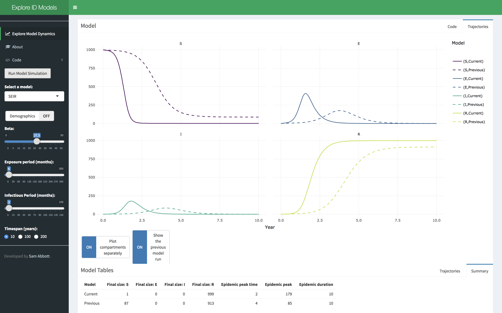

<!-- README.md is generated from README.Rmd. Please edit that file -->
Infectious Disease Modelling Utilities 
==========================================================================================================

[](https://cran.r-project.org/package=idmodelr) [](https://github.com/idmodelr) [](https://www.samabbott.co.uk/idmodelr/) [](https://www.samabbott.co.uk/idmodelr/dev) [](https://mybinder.org/v2/gh/seabbs/idmodelr/master?urlpath=rstudio) [](https://travis-ci.org/seabbs/idmodelr) [](https://ci.appveyor.com/project/seabbs/idmodelr) [](https://codecov.io/github/seabbs/idmodelr?branch=master) [](https://cran.r-project.org/package=idmodelr) [](https://cran.r-project.org/package=idmodelr)

`idmodelr` is an R package that contains utility functions for infectious disease modelling. It also offers some simple compartmental ODE models which can be used for teaching purposes or as the basis for more complex models.

Quickly and easily import analysis ready Tuberculosis (TB) burden data, from the World Health Organisation (WHO), into R. The aim of `getTBinR` is to allow researchers, and other interested individuals, to quickly and easily gain access to a detailed TB data set and to start using it to derive key insights. It provides a consistent set of tools that can be used to rapidly evaluate hypotheses on a widely used data set before they are explored further using more complex methods or more detailed data. These tools include: generic plotting and mapping functions; a data dictionary search tool; an interactive shiny dashboard; and an automated, country level, TB report. For newer R users, this package reduces the barrier to entry by handling data import, munging, and visualisation. All plotting and mapping functions are built with `ggplot2` so can be readily extended. See [here](http://www.who.int/about/copyright/en/) for the WHO data permissions. For help getting started see the [Getting Started](https://www.samabbott.co.uk/getTBinR/articles/intro.html) vignette and for a case study using the package see the [Exploring Global Trends in Tuberculosis Incidence Rates](https://www.samabbott.co.uk/getTBinR/articles/case_study_global_trends.html) vignette.

`idmodelr` is intended to act as both a tool for understanding infectious disease models and as a resource for modellers looking for inspiration. As such having as wide a coverage of model types as possible will only improve the package functionality.

Installation
------------

You can install idmodelr from github with:

``` r
# install.packages("devtools")
devtools::install_github("seabbs/idmodelr")
```

Quick start
-----------

Dashboard
---------

A shiny application has been developed that showcases some of the functionality of the `idmodelr` package. This application allows the parameter spaces of a range of models built into `idmodelr` to be explored in an interactive session. It is designed to be used as a teaching aid when introducing people to the concepts behind infectious disease models without requiring them to interact with the underlying code. The code for the dashboard can be found [here](https://github.com/seabbs/exploreidmodels). It can be run locally using the following (*Note: this will install required packages to your system*),

``` r
#install.packages("shiny")
shiny::runGitHub("exploreidmodels", "seabbs")
```

or accessed [online](http://www.seabbs.co.uk/shiny/exploreidmodels) (*Note: This version may not be fully up to date*).



Contributing
------------

### Contributing a model

Additional models are extremely welcome!

To add models in the same family as those already implemented (i.e [`SIR_ode`](https://github.com/seabbs/idmodelr/blob/master/R/SIR_ode.R)) please follow the implemented coding style closely (alternatively open an [issue](https://github.com/seabbs/idmodelr/issues) explaining why this style needs updating). An entry to the `implemented_model_table` is also required (see <https://github.com/seabbs/idmodelr/blob/master/data-raw/implemented_model_table.R> for help with this). Models can either be added via a pull request (i.e make all desired changes and then run `make`) or via an issue.

To add a new family of models (i.e stochastic models (*Note: These are currently planned in the current development cycle*)) please open an [issue](https://github.com/seabbs/idmodelr/issues) outlining your proposed approach. A new family of models is likely to require at least its own `solve_` (equivalent to [`solve_ode`](https://github.com/seabbs/idmodelr/blob/master/R/solve_ode.R)) function and may also require other package changes.

### Other contributions

File an issue [here](https://github.com/seabbs/idmodelr/issues) if there is any other feature, that you think is missing from the package, or better yet submit a pull request!

Please note that the `idmodelr` project is released with a [Contributor Code of Conduct](.github/CODE_OF_CONDUCT.md). By contributing to this project, you agree to abide by its terms.

### Docker

This packge was developed in a docker container based on the [tidyverse](https://hub.docker.com/r/rocker/tidyverse/) docker image. To run the docker image run:

``` bash
docker run -d -p 8787:8787 --name idmodelr -e USER=seabbs -e PASSWORD=seabbs seabbs/idmodelr
```

The rstudio client can be found on port `:8787` at your local machines ip. The default username:password is seabbs:seabbs, set the user with `-e USER=username`, and the password with `- e PASSWORD=newpasswordhere`. The default is to save the analysis files into the user directory. Alternatively, access the development environment via [binder](https://mybinder.org/v2/gh/seabbs/idmodelr/master?urlpath=rstudio).
