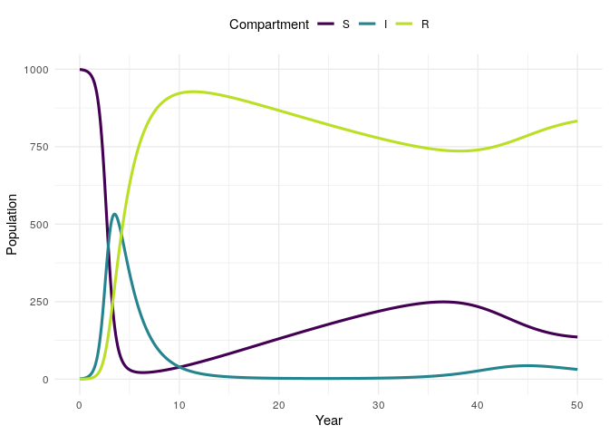
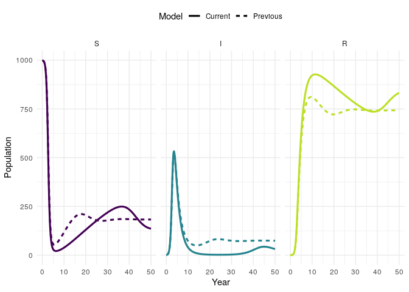

<!-- README.md is generated from README.Rmd. Please edit that file -->

# Infectious disease model library and utilities 

[](https://www.repostatus.org/#wip)
[](https://cran.r-project.org/package=idmodelr)
[](https://github.com/idmodelr)
[](https://www.samabbott.co.uk/idmodelr/)
[](https://www.samabbott.co.uk/idmodelr/dev)
[](https://mybinder.org/v2/gh/seabbs/idmodelr/master?urlpath=rstudio)
[](https://travis-ci.org/seabbs/idmodelr)
[](https://ci.appveyor.com/project/seabbs/idmodelr)
[](https://codecov.io/github/seabbs/idmodelr?branch=master)
[](https://cran.r-project.org/package=idmodelr)
[](https://cran.r-project.org/package=idmodelr)
[](https://doi.org/10.5281/zenodo.2641048)

Explore a range of infectious disease models in a consistent framework.
The primary aim of `idmodelr` is to provide a library of infectious
disease models for researchers, students, and other interested
individuals. These models can be used to understand the underlying
dynamics and as a reference point when developing models for research.
`idmodelr` also provides a range of utilities. These include: plotting
functionality; a simulation wrapper; scenario analysis tooling; an
interactive dashboard; tools for handling mult-dimensional models; and
both model and parameter look up tables. Unlike other modelling packages
such as [`pomp`](https://kingaa.github.io/pomp/),
[`libbi`](http://libbi.org) and [`EpiModel`](http://www.epimodel.org),
`idmodelr` serves primarily as an educational resource. After users have
explored model dynamics with `idmodelr` they may then implement their
model using one of these packages in order to utilise the model fitting
tools they provide. For newer modellers, this package reduces the
barrier to entry by containing multiple infectious disease models,
providing a consistent framework for simulation and visualisation, and
signposting towards other, more research, focussed resources.

## Installation

You can install the development version of `idmodelr` from github with:

``` r
# install.packages("devtools")
devtools::install_github("seabbs/idmodelr")
```

## Quick start

In this quick start guide we are going to be defining, simulating and
plotting a Susceptible-Infected-Recovered deterministic compartmental
model with simple population demographics (births = deaths). The first
step is to load the `idmodelr` package.

``` r
library(idmodelr)
```

The next step is to find the model of interest amongst those implemented
in `idmodelr`. `model_details` lists all of the models implemented in
`idmodelr` and can be search using `dplyr`, base R, or other dataframe
tools.

``` r
library(dplyr)
#> 
#> Attaching package: 'dplyr'
#> The following objects are masked from 'package:stats':
#> 
#>     filter, lag
#> The following objects are masked from 'package:base':
#> 
#>     intersect, setdiff, setequal, union

model_details %>% 
  dplyr::filter(model_family %in% "SIR") %>% 
  knitr::kable()
```

| model                               | model\_family | time       | type          | recovered | exposed | treated | susceptible | risk\_stratified | non\_exponential | simple\_demographics | vaccination | disease\_example | language | parameters                                |
| :---------------------------------- | :------------ | :--------- | :------------ | :-------- | :------ | :------ | :---------- | :--------------- | :--------------- | :------------------- | :---------- | :--------------- | :------- | :---------------------------------------- |
| SIR\_ode                            | SIR           | continuous | deterministic | no        | no      | no      | no          | no               | no               | no                   | no          | none             | R        | c(“beta”, “tau”)                          |
| SIR\_demographics\_ode              | SIR           | continuous | deterministic | no        | no      | no      | no          | no               | no               | yes                  | no          | none             | R        | c(“beta”, “tau”, “mu”)                    |
| SIR\_vaccination\_ode               | SIR           | continuous | deterministic | no        | no      | no      | no          | no               | no               | no                   | yes         | none             | R        | c(“beta”, “tau”, “lambda”)                |
| SIR\_vaccination\_demographics\_ode | SIR           | continuous | deterministic | no        | no      | no      | no          | no               | no               | yes                  | yes         | none             | R        | c(“beta”, “tau”, “lambda”, “alpha”, “mu”) |

Now look at the model and the model help file (`?SIR_demographics_ode`)
to get an understanding of how the model is constructed.

``` r
SIR_demographics_ode
#> function(t, x, params) {
#> 
#>   ## Specify model compartments
#>   S <- x[1]
#>   I <- x[2]
#>   R <- x[3]
#> 
#>   with(as.list(params),{
#> 
#>     ## Specify total population
#>     N = S + I + R
#> 
#>     ## Derivative Expressions
#>     dS = - beta * S * I / N - mu * S + mu * N
#>     dI = beta * S * I / N - tau * I - mu * I
#>     dR = tau * I - mu * R
#> 
#>     ## output
#>     derivatives <- c(dS, dI, dR)
#> 
#>     list(derivatives)
#>   })
#> }
#> <bytecode: 0x5593deb733d8>
#> <environment: namespace:idmodelr>
```

Check the parameters required by the model using `required_parameters`.
This returns a table containing all the parameters that must be defined
in order to use the model as well as descriptive information for each
parameter.

``` r
parameters <- required_parameters("SIR_demographics_ode")

knitr::kable(parameters)
```

| parameter | parameter\_family | description                                                                                                               | type | risk\_stratified | non\_exponential |
| :-------- | :---------------- | :------------------------------------------------------------------------------------------------------------------------ | :--- | :--------------- | :--------------- |
| beta      | transmission      | Transmission rate = the transmission probability per contact \* the number of contacts each individual has.               | rate | no               | no               |
| tau       | recovery          | Recovery rate. The reciprocal of the time infectious.                                                                     | rate | no               | no               |
| mu        | demographics      | The natural mortality rate. The reciprocal of the average lifespan. (for simple demographics this is also the birth rate. | rate | no               | no               |

Parameterise the model.

``` r
parameters <- c(
  beta = 3, ##Transmission rate = contact rate * transmission probablity
  tau = 0.5, ## Rate recovcery = 1 / duration of infection
  mu = 1/81 ## Natural birth/death rate = 1 / average lifespan
)
```

Check the initial conditions required by looking at the start of the
model function. In most cases this should match up to the model name
(i.e S, I and R for an SIR model) but risk stratification etc. will
require additional compartments.

``` r
inits <- c(
  S = 999,
  I = 1,
  R = 0
  )
```

Specify the timespan over which to run the model.

``` r
times <- seq(0, 50, 0.1)
```

Simulate the model.

``` r
traj <- solve_ode(model = SIR_demographics_ode,
          inits, parameters,
          times, as.data.frame = TRUE)


traj
#> # A tibble: 501 x 4
#>     time     S     I      R
#>    <dbl> <dbl> <dbl>  <dbl>
#>  1   0    999   1    0     
#>  2   0.1  999.  1.28 0.0567
#>  3   0.2  998.  1.64 0.129 
#>  4   0.3  998.  2.11 0.222 
#>  5   0.4  997.  2.70 0.342 
#>  6   0.5  996.  3.46 0.494 
#>  7   0.6  995.  4.43 0.690 
#>  8   0.7  993.  5.67 0.940 
#>  9   0.8  991.  7.25 1.26  
#> 10   0.9  989.  9.28 1.67  
#> # … with 491 more rows
```

Summarise the model.

``` r
summarise_model(traj) %>% 
  knitr::kable()
```

| Final size: S | Final size: I | Final size: R | Epidemic peak time | Epidemic peak | Epidemic duration |
| ------------: | ------------: | ------------: | -----------------: | ------------: | ----------------: |
|           136 |            31 |           833 |                3.5 |           533 |               Inf |

Plot the model trajectory.

``` r
plot_model(traj, facet = FALSE)
```

<!-- -->

Vary the model parameters, by increasing the mortality rate, and then
simulate the updated model.

``` r
parameters_up <- parameters
parameters_up["mu"] <- 1 / 20


traj_up <- solve_ode(model = SIR_demographics_ode,
          inits, parameters_up,
          times, as.data.frame = TRUE)
```

Plot the original trajectory and the updated trajectory. What has the
impact of increasing mortality been?

``` r
plot_model(traj, traj_up, facet = TRUE)
```

<!-- -->

See the package vignettes for more help getting started and some
additional ideas for exploring infectious disease model dynamics.

## Dashboard

A shiny application has been developed that showcases some of the
functionality of the `idmodelr` package. This application allows the
parameter spaces of a range of models built into `idmodelr` to be
explored in an interactive session. It is designed to be used as a
teaching aid when introducing people to the concepts behind infectious
disease models without requiring them to interact with the underlying
code. The code for the dashboard can be found
[here](https://github.com/seabbs/exploreidmodels). It can be run locally
using the following (*Note: this will install required packages to your
system*),

``` r
#install.packages("shiny")
shiny::runGitHub("exploreidmodels", "seabbs")
```


## Contributing

### Contributing a model

Additional models are extremely welcome\!

To add models in the same family as those already implemented (i.e
[`SIR_ode`](https://github.com/seabbs/idmodelr/blob/master/R/SIR.R))
please follow the implemented coding style closely (alternatively open
an [issue](https://github.com/seabbs/idmodelr/issues) explaining why
this style needs updating). Models should be named using their
compartments in capitals followed by lower case model details, and
finally the model type. An example of this is the `SIR_demographics_ode`
model. For highly complex models only the most major model details
should be listed (aim for less than 40 characters). An entry for
`model_details` is also required (see
[`model_details.R`](https://github.com/seabbs/idmodelr/blob/master/data-raw/model_details.R%20for%20help%20with%20this)).
Please consider also adding to the testing suite for your new model.
Models can either be added via a pull request (i.e make all desired
changes and then run `make`) or via an issue.

To add a new family of models (i.e stochastic models) please open an
[issue](https://github.com/seabbs/idmodelr/issues) outlining your
proposed approach. A new family of models is likely to require at least
its own `solve_` (equivalent to
[`solve_ode`](https://github.com/seabbs/idmodelr/blob/master/R/solve.R))
function and may also require other package changes.

### Other contributions

File an issue [here](https://github.com/seabbs/idmodelr/issues) if there
is any other feature, that you think is missing from the package, or
better yet submit a pull request\!

Please note that the `idmodelr` project is released with a [Contributor
Code of Conduct](.github/CODE_OF_CONDUCT.md). By contributing to this
project, you agree to abide by its terms.

### Docker

This packge was developed in a docker container based on the
[tidyverse](https://hub.docker.com/r/rocker/tidyverse/) docker image. To
run the docker image
run:

``` bash
docker run -d -p 8787:8787 --name idmodelr -e USER=seabbs -e PASSWORD=seabbs seabbs/idmodelr
```

The rstudio client can be found on port `:8787` at your local machines
ip. The default username:password is seabbs:seabbs, set the user with
`-e USER=username`, and the password with `- e
PASSWORD=newpasswordhere`. The default is to save the analysis files
into the user directory. Alternatively, access the development
environment via
[binder](https://mybinder.org/v2/gh/seabbs/idmodelr/master?urlpath=rstudio).
